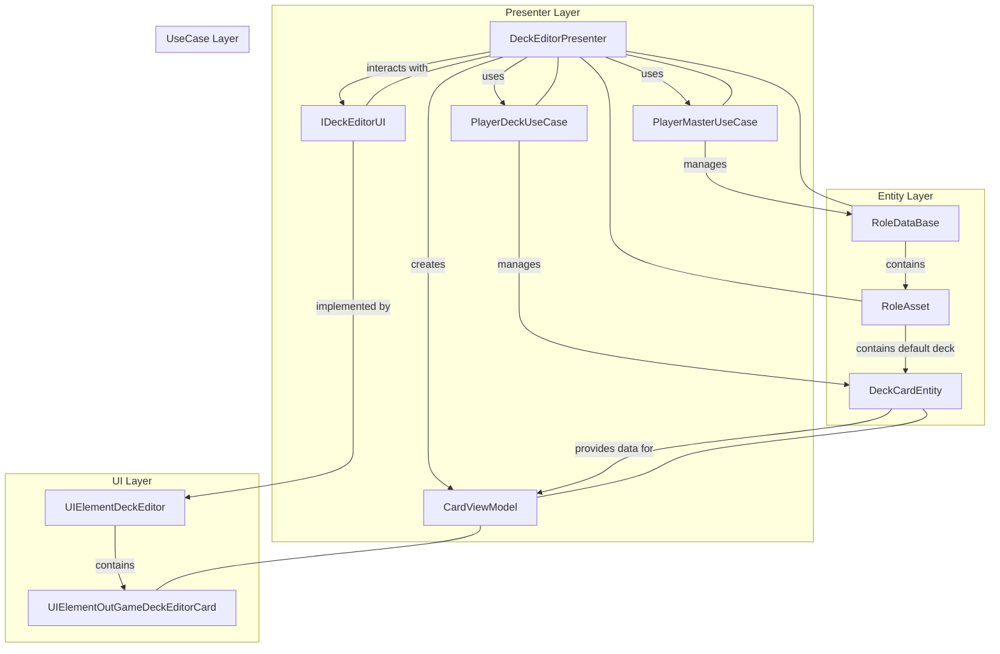

```mermaid
graph TD
    subgraph Presenter Layer
        DeckEditorPresenter -- uses --> PlayerDeckUseCase
        DeckEditorPresenter -- uses --> PlayerMasterUseCase
        DeckEditorPresenter -- interacts with --> IDeckEditorUI
        DeckEditorPresenter -- creates --> CardViewModel
    end

    subgraph UI Layer
        IDeckEditorUI -- implemented by --> UIElementDeckEditor
        UIElementDeckEditor -- contains --> UIElementOutGameDeckEditorCard
    end

    subgraph Entity Layer
        DeckCardEntity -- provides data for --> CardViewModel
        RoleDataBase -- contains --> RoleAsset
        RoleAsset -- contains default deck --> DeckCardEntity
    end

    subgraph UseCase Layer
        PlayerDeckUseCase -- manages --> DeckCardEntity
        PlayerMasterUseCase -- manages --> RoleDataBase
    end

    DeckEditorPresenter --- IDeckEditorUI
    CardViewModel --- UIElementOutGameDeckEditorCard
    DeckCardEntity --- CardViewModel
    RoleDataBase --- DeckEditorPresenter
    RoleAsset --- DeckEditorPresenter
    PlayerDeckUseCase --- DeckEditorPresenter
    PlayerMasterUseCase --- DeckEditorPresenter
```
